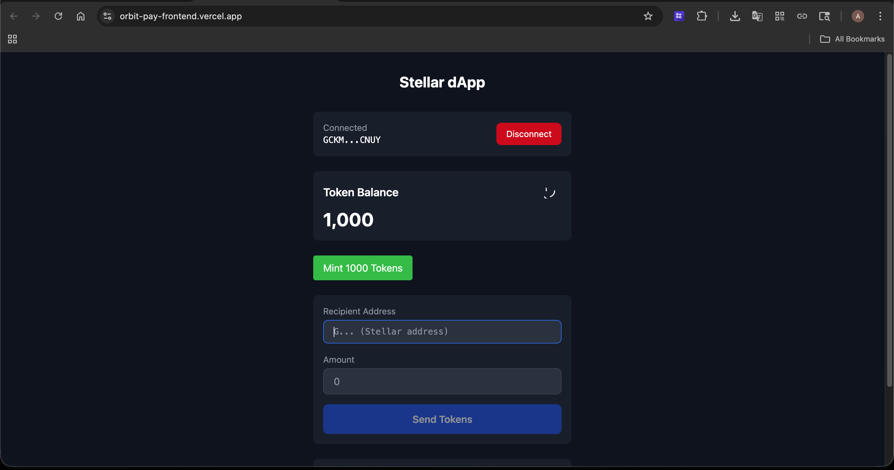
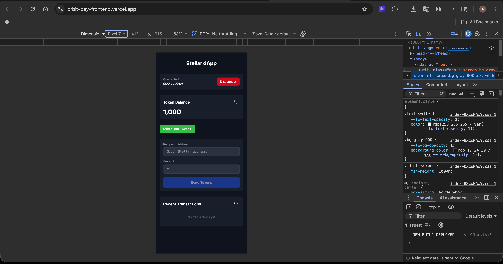

# 🚀 OrbitPay

A production-ready Stellar Soroban dApp for seamless token transfers with real-time event tracking and wallet integration.
[](https://github.com/yourusername/stellar-dapp/actions/workflows/ci.yml)

A production-ready full-stack decentralized application built on the Stellar blockchain using Soroban smart contracts.

## Live Demo

**Testnet URL**: https://your-dapp.vercel.app

> Note: This dApp connects to Stellar Testnet. Use the Freighter wallet extension to interact.

## Features

- **Custom Token** - Fungible token with mint and transfer capabilities
- **Inter-Contract Calls** - PaymentHelper for seamless token transfers
- **Real-Time Event Tracking** - Live transaction list with auto-refresh
- **Wallet Integration** - Freighter wallet for signing transactions

## Tech Stack

| Layer | Technology |
|-------|------------|
| Smart Contracts | Rust + Soroban SDK |
| Blockchain | Stellar (Testnet) |
| Frontend | React 18 + TypeScript |
| Build | Vite |
| Styling | Tailwind CSS |
| Wallet | Freighter |

## Screenshots

### Desktop


### Mobile Responsive



## Folder Structure

```
stellar-dapp/
├── .github/workflows/     # CI/CD pipeline
├── contracts/
│   ├── token/           # Token contract
│   └── payment_helper/ # Payment helper contract
├── frontend/
│   ├── src/
│   │   ├── components/ # React components
│   │   ├── hooks/     # Custom hooks
│   │   └── lib/       # Stellar SDK integration
│   └── package.json
├── Cargo.toml           # Rust workspace
├── package.json        # Root package
└── README.md
```

## Quick Start

### 1. Install Dependencies

```bash
# Frontend
cd frontend && npm install

# Rust (if building contracts)
cargo build --workspace --target wasm32v1-none --release
```

### 2. Configure Environment

Create `frontend/.env`:

```env
VITE_STELLAR_RPC_URL=https://soroban-testnet.stellar.org:443
VITE_NETWORK=Test SDF Network ; September 2015
VITE_TOKEN_CONTRACT=<your-token-contract-id>
VITE_HELPER_CONTRACT=<your-helper-contract-id>
```

### 3. Run Development Server

```bash
cd frontend
npm run dev
```

### 4. Build for Production

```bash
# Contracts
cargo build --workspace --target wasm32v1-none --release

# Frontend
cd frontend && npm run build
```

## Contract Details

### Token Contract

| Field | Value |
|-------|-------|
| Network | Testnet |
| Contract ID | `CCXJ5UCFQLRFKIXQXZQH5ZHQZWUYF5ZCBL45RQOEALNKVIWSMUJCLEQJ` |
| Functions | `init`, `mint`, `transfer`, `balance_of` |

### PaymentHelper Contract

| Field | Value |
|-------|-------|
| Network | Testnet |
| Contract ID | `CB4GDMJ5DUKZPVH6WQUP7IBL5UGZHKJZVGD4BZM7VEA7W6HWN6ZDJZQ` |
| Functions | `send_token_from`, `get_token_balance` |

### Sample Transaction

| Field | Value |
|-------|-------|
| Hash | `8a2c9e3d...` |
| Ledger | `123456` |
| Timestamp | `2024-01-15 10:30:00 UTC` |

## Deployment

### Vercel (Frontend)

1. Connect repository to Vercel
2. Configure environment variables in Vercel dashboard
3. Deploy automatically on push to main

```bash
# Build for production
cd frontend && npm run build
```

### Manual Deployment

```bash
# 1. Deploy token contract
soroban contract deploy \
  --wasm target/wasm32v1-none/release/token.wasm \
  --source <secret-key> \
  --network testnet

# 2. Deploy payment helper
soroban contract deploy \
  --wasm target/wasm32v1-none/release/payment_helper.wasm \
  --source <secret-key> \
  --network testnet

# 3. Update .env with contract IDs
```

## Available Scripts

| Script | Description |
|--------|-------------|
| `npm run dev` | Start dev server |
| `npm run build` | Build frontend |
| `cargo build --workspace` | Build contracts |

## Contributing

1. Fork the repository
2. Create a feature branch
3. Commit your changes
4. Push to the branch
5. Open a Pull Request

## License

MIT
